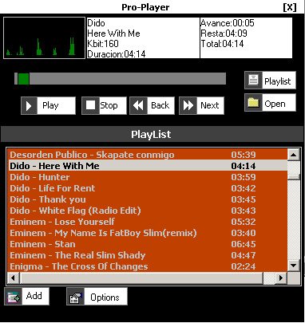



## Pro\-Player v1\.0

### Description

This is the first version the pro-player, wait more submit in the future!!!

This a simple Mp3 player, this code use Direct Show (the FilgraphManager object) to play the mp3 files, and wave's Apis to represent the sound in sine-scope, FTT-scope, and bars-scope, playlist.

all code was wrote by me

If u like my code, post ur comment and give me ur Vote =)

have fun!!
 
### More Info
 

             |
---                |---
**Submitted On**   |2004-09-02 14:38:54
**By**             |[Int\_21](https://github.com/Planet-Source-Code/PSCIndex/blob/master/ByAuthor/int-21.md)
**Level**          |Advanced
**User Rating**    |4.0 (8 globes from 2 users)
**Compatibility**  |VB 6\.0
**Category**       |[Sound/MP3](https://github.com/Planet-Source-Code/PSCIndex/blob/master/ByCategory/sound-mp3__1-45.md)
**World**          |[Visual Basic](https://github.com/Planet-Source-Code/PSCIndex/blob/master/ByWorld/visual-basic.md)
**Archive File**   |[Pro\-Player178882922004\.zip](https://github.com/Planet-Source-Code/int-21-pro-player-v1-0__1-55971/archive/master.zip)

